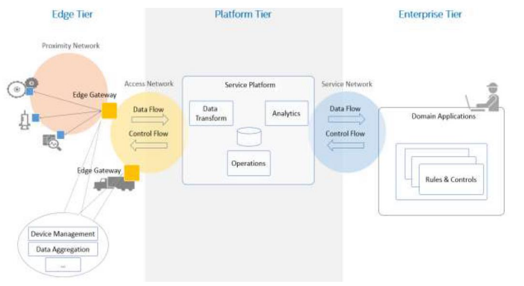

# Web II

## Diferencias entre Web I y Web II
- En Web I hemos visto mas HMI (HTML, CSS, JS) (presentar los datos como objetivo)
    - Framework J2EE
- En Web II posibilitar el intercambio de datos no solo de hombre maquina sino también de transferencia de datos entre maquinas
    - ¿Porque? Concepto de IoT
        - Todos los dispositivos, intercambio de datos

## Arquitectura IoT
- Edge Tier
    - Gateway
        - Acumula informacion o filtra esa información y luego lo intercambia con el Platform tier
- Platform Tier
    - Se encarga de almacenar los datos
    - Analiticas
    - Operaciones
- Enterprise Tier
    - Quema de estos datos

## Tipos de Interoperabilidad
- Interoperabilidad técnica:
    - TCP, IP HTTP, Bluetooth
- Interoperabilidad sintáctica:
    - XML, JSON
- Interoperabilidad semántica (NO LO VAMOS A DAR):
    - Teniendo en cuenta el contexto, sin contexto ese valor no tendría sentido
    - Además de mandar una temperatura, le mandamos un contexto (X engranaje en X empresa)
- Ineroperabilidad organizativa:
    - Define el contexto necesario para que las organizaciones puedan cooperar. Reglas del negocio, procedimientos y flujos de trabajo

## Protocol paradigms
Formas de intercambiar datos

- Publish/Suscribe:
    - Con Txema
    - MQTT, AMQP, XMPP
    - Yo he hecho algo y mando un mensaje y el que esta interesado (suscrito) recive la información
- Web Services:
    - Ofrecer servicios utilizando la arquitectura REST y SOAP
    - Pedir y me da (petición a demanda) (request/response)

Luego estas dos se pueden integrar